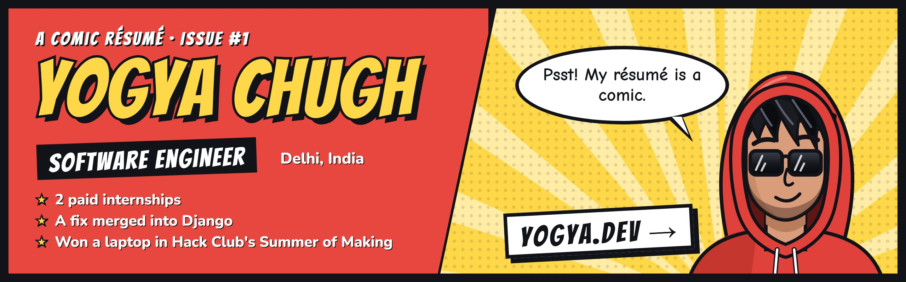

  
  
  

## Hey, I'm Yogya 👋

I build things to find out how they work. Right now I'm a **Software Engineering Intern at [Meant2Bae](https://www.meant2bae.com)**, building a cross-platform app for a freelance client, and working on **AnyStudio** on the side.

My whole résumé is a comic at **[yogya.dev](https://yogya.dev)**. It's the fastest way to see what I've done, and probably the only résumé with a "Who's reading?" button.

## Highlights

- 💼 **2 paid internships.** Now at Meant2Bae. Before that, at Vardhman Electricals, I built **[Vardhman Saathi](https://vardhmansaathi.shop)** end to end: an Android app, an admin desktop app and the backend. 200+ people use it at once, and it costs **$0 a month** to run.
- 🐍 **A fix merged into Django.** [django/django #19295](https://github.com/django/django/pull/19295) made the template engine show the right error instead of a confusing one.
- 💻 **Won a laptop by coding all summer.** 450+ hours across 4 projects in Hack Club's Summer of Making 2025 got me a Gigabyte Aero X16 and $25 of Steam games.
- 🤖 **3rd place, twice.** Pippo, our multilingual navigation robot, placed at hackathons at the University of Derby and Ulster University in 2025.

## What I'm building

- **[AnyStudio](https://yogya.dev/#ep9)**: describe an app in plain words or drag it together, and get a real native Android and iPhone app. Written in Rust, in development.
- **[Webelo](https://github.com/YogyaChugh/Webelo)**: a C++ library that implements the WHATWG DOM standard, with Python bindings and a viewer that draws any web page as a tree. The long-term goal is a full browser.
- **[Timberly](https://yogya-chugh.itch.io/timberly)**: a lumberjack game with an online leaderboard, for the web, Windows, macOS and Linux. [Play it](https://yogya-chugh.itch.io/timberly) or [read the code](https://github.com/YogyaChugh/Timberly).

## Tech I use

**Languages:** C++ · Rust · Python · TypeScript · JavaScript · SQL  
**Apps:** React · React Native · Expo · Electron  
**Backend:** Django · FastAPI · Flask · Node.js · Hono  
**Data & cloud:** PostgreSQL · Supabase · Cloudflare (Workers, R2, D1, Pages) · Firebase  
**Games, for fun:** Pygame · SDL · SFML

## Latest from the blog

<!-- BLOG-POST-LIST:START -->
- [My first open-source contribution](https://yogya.dev/blogs/first_open_source)
- [Running a real product for $0 a month](https://yogya.dev/blogs/vardhman)
- [Implementing the WHATWG DOM in C++](https://yogya.dev/blogs/whatwg_dom)
- [450 hours, 4 ships, one laptop](https://yogya.dev/blogs/summer_of_making)
<!-- BLOG-POST-LIST:END -->

## Failures (they taught me the most)

- **Google Summer of Code 2025 (Django):** didn't get in. It's how I got into open source, and my Django fix got merged anyway.
- **Smart India Hackathon 2024 and 2025:** made the internal rounds, not further. Building a blockchain tourist ID system with a team showed me why DevOps exists.

## Let's talk

Open to freelance projects and collaborations, in any language with good docs.

  
  
  
  
  

